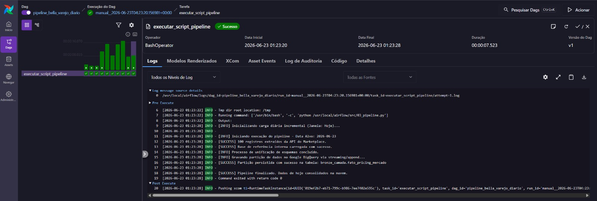
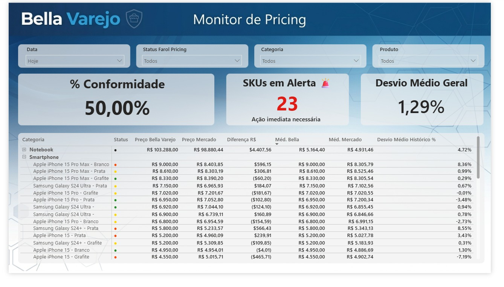

# Projeto Bella Varejo: Automação de Pricing e Analytics

## Visão Geral

O **Bella Varejo** é um projeto de engenharia de dados *end-to-end* desenvolvido para automatizar o monitoramento de precificação e conformidade de SKUs. O objetivo é transformar dados brutos em decisões estratégicas, reduzindo drasticamente o tempo operacional de análise.

## 📸 Evidências do Projeto

|                   Orquestração (Airflow)                   |                         Dashboard (Power BI)                         |
| :----------------------------------------------------------: | :-------------------------------------------------------------------: |
|  |  |

## 🏗️ Arquitetura e Engenharia

* **Arquitetura Medallion:** Pipeline organizado em camadas (Bronze, Silver e Gold) para garantir governança e qualidade dos dados.
* **Orquestração:** Apache Airflow (via Astronomer) automatizando a carga incremental diária.
* **Processamento:** Python (`Pandas`) para consumo de API com tratamento de erros.
* **Data Warehouse:** Google BigQuery (modelo *Star Schema*).
* **Visualização:** Power BI (UI/UX focado em detecção de desvios de preço).

## 🚀 Impacto no Negócio

* **Eficiência:** Eliminação de processos manuais, permitindo foco em análise estratégica.
* **Monitoramento:** Identificação automática de SKUs fora da conformidade de mercado.
* **Escalabilidade:** Arquitetura pronta para suportar o crescimento do volume de SKUs com o padrão Medallion.

## 🛠️ Tecnologias

`Python (Pandas/Requests)`, `Apache Airflow`, `SQL`, `Google BigQuery`, `Power BI`, `Docker`.
